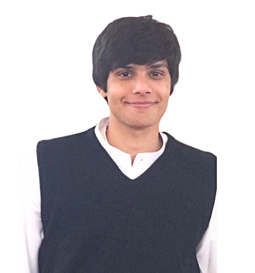

  

    <h2>About Me</h2>
    
Hi, I'm Azeem. I am a computer scientist who enjoys researching how humans operate when it comes to language and their cognitive abilities. I graduated from Habib University in 2024 with a <strong>BS (Honors) in Computer Science</strong> and a minor in <strong>Electrical and Computer Engineering</strong>. My research currently focuses on cognition and linguistics, more specifically, how visual context plays a role in the way people perceive concepts.

  

  

    
  

<h2>Research Interest</h2>

My research interests lie in the domains of computational linguistics, semantics, and syntax. Specifically, I want to focus on understanding how language is structured in the brain and syntactically produced in different contexts. I am also interested in language acquisition in children raised in multilingual environments and how this upbringing influences their linguistic development. Additionally, I want to explore the syntactic degeneration in multilingual individuals caused by Broca's area aphasia.

Beyond these topics, I am intrigued by the evolving nature of online language, which at times feels completely different from natural languages. As communication increasingly relies on memes and online jokes, I seek to understand the cognitive processes and reasoning behind these new forms of expression. I believe this new form of communication has the potential to reflect one's mental well-being and cognitive processes. Additionally, I enjoy creating visualizations and presenting data in a clear and compelling narrative.

<h2>Publications</h2>
<ol style="text-align: justify;">
  <li><strong>Haider, M. A.</strong> & Sohail, M. & Raza, S. & Siddiqui, M. A. (August, 2024). "Evolutionary Algorithm-Based Composition of Classical South Asian Music using Tabla." <strong>[Under Review]</strong>.</li>
</ol>

<h2>Academic Presentations</h2>
<ol style="text-align: justify;">
  <li><strong>Haider, M. A.</strong> & Yousuf, A. A. & Haider, I. A. & Mahmood, S. (May, 2024). "Forecasting Electricity for Pakistan." <em>Habib University Dhanani Undergraduate Research Symposium</em>. <a href="https://drive.google.com/file/d/1_Skc__z9kV9kZbt7JCCWqxnovz6k2ltD/view?usp=sharing" target="_blank">[Poster]</a></li>
  <li>Hussain, S. M. & <strong>Haider, M. A.</strong> & Habib, Affanullah (August, 2023). "Automated Video Summarization for Suspicious Event Detection in Surveillance Systems: A Pipeline Approach." <em>International Bhurban Conference of Applied Science and Technology</em>. Paper will be published on IEEE Xplore. <a href="https://drive.google.com/file/d/1jjZel8WgHdKBBNHmhf3zk_vZT2q8ZVp_/view?usp=sharing" target="_blank">[Paper]</a></li>
</ol>

<h2>Active Research Projects</h2> 
<ol style="text-align: justify;"> 
  <li><strong>Cognition in Context:</strong> This project investigates the impact of visual context on concept description. Data collection involved interviewing 151 participants, transcribing their responses, and categorizing them. The research is currently in the results compilation stage.</li> 
  <li><strong>Short-Term Load Forecasting (STLF) for Legacy Appliances:</strong> This project aims to predict electricity usage in households with legacy appliances, which lack the metadata provided by smart appliances. Data from 1,300+ households over 17 months has been collected and supplemented with synthetic data. The focus is on developing the best method or architecture for predicting electricity usage in these households.</li>
  <li><strong>Gendered Impact of Locust Swarms in Ethiopia:</strong> This research investigates the socio-economic impact of locust swarms in Ethiopia, focusing on gender differences. The study employs a difference-in-differences approach to analyze the effects.</li>
</ol>

<h2>Awards and Grants</h2>
<ol style="text-align: justify;">
  <li>Recipient of 100% undergraduate merit scholarship (2020-2024) <a href="https://habib.edu.pk/admissions/hutops/" target="_blank">Habib University TOPS Scholar</a></li>
  <li>Recipient of the <a href="https://www.hertie-school.org/en/study/data-for-good-scholarship" target="_blank">Data for Good scholarship</a> at Hertie School, Germany, valued at £36,500 (Opted not to accept)</li>
</ol>

<h2 style="text-align: justify;">Teaching</h2>
<ul>
  <li>Teaching Assistant at Habib University for Introduction to Data Analytics (Spring 2024)</li>
</ul>

   

  
  
  
  

